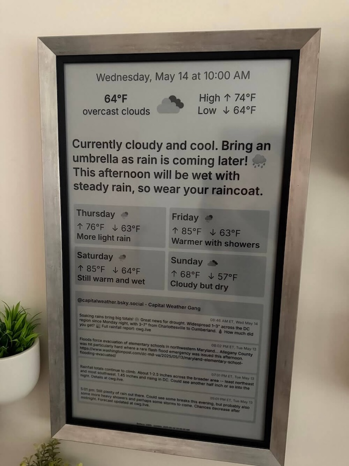

# Kid-Friendly Weather Description Service

A Python service that generates natural, kid-friendly weather descriptions using OpenWeatherMap and an LLM API (can be a small, self hosted model).

I wrote a [blog post](https://eli.pizza/posts/eink-weather-display-for-kids/) about how I use it as part of a weather eInk display:



The display is driven by a $40 single board computer and shows weather forecasts that can be easily understood.

---

## What It Does

Transforms complex weather data into simple, engaging descriptions that kids can understand. Instead of "Partly cloudy with 70% chance of precipitation," you get "It might rain later - maybe bring an umbrella! 🌧️"

The service includes:
- Command-line weather reports
- Flask web application with HTML interface
- A shared service layer (`WeatherReportService`) used by every entrypoint
- API caching for performance
- LLM interaction logging and replay capabilities
- Support for multiple LLM providers with automatic fallback

## Requirements

- Python 3.9+
- [uv](https://github.com/astral-sh/uv) for dependency management (optional, but recommended)
- OpenWeatherMap API key (free tier works fine)
- LLM API key (DeepSeek, OpenAI, OpenRouter, or any OpenAI-compatible API)

## Installation

1. Install uv if you haven't already:
```bash
curl -LsSf https://astral.sh/uv/install.sh | sh
```

2. Clone this repository

3. Create and activate a virtual environment:
```bash
uv venv
source .venv/bin/activate  # On Windows: .venv\Scripts\activate
```

4. Install dependencies:
```bash
pip install -r requirements.txt
```

5. Copy the example environment file and configure your API keys:
```bash
cp .env.example .env
# Edit .env with your API keys
```

## Usage

### Command-Line Script

Generate a weather report for a specific location:
```bash
uv run ./weather_cli.py --lat 38.9 --lon -77.0
```

Load test data from a file (files live in `test_data/` by default):
```bash
uv run ./weather_cli.py --load dc1
```

Save weather data for testing (writes to `test_data/` unless you supply `--save` with a different path):
```bash
uv run ./weather_cli.py --lat 38.9 --lon -77.0 --save dc_latest
```

Log LLM interactions:
```bash
uv run ./weather_cli.py --lat 38.9 --lon -77.0 --log-interactions
```

See what the model was told:
```bash
uv run ./weather_cli.py --lat 38.9 --lon -77.0 --verbose
```

### Flask Web App

Run the web server (defaults to port 5001):
```bash
uv run app.py
```

Then open http://127.0.0.1:5001 in your browser.

Available endpoints:
- `/`: HTML weather report
- `/weather.json`: JSON weather report
- `/weather.txt`: Plain text weather description

Render HTML directly to a file:
```bash
uv run app.py --render page.html
```

### LLM Replay Script

Replay logged LLM interactions with different prompts or models:
```bash
uv run replay.py --log-id 5
uv run replay.py --log-id 5 --new-model deepseek-coder
uv run replay.py --log-id 5 --prompt "You are a pirate weather forecaster."
```

## Example Output

```json
{
  "description": "It's cool right now, maybe wear a light jacket. 🧥 The rest of the day looks cloudy but nice!",
  "daily_forecasts": [
    "Monday: Cloudy day ☁️",
    "Tuesday: Rain coming later 🌧️",
    "Wednesday: Still rainy",
    "Thursday: Cloudy again"
  ],
  "temperature": 47,
  "feels_like": 44,
  "conditions": "overcast clouds",
  "high_temp": 59,
  "low_temp": 47,
  "icon_url": "http://openweathermap.org/img/wn/04d@4x.png",
  "alerts": [],
  "last_updated": "Friday, April 11 at 11:30 AM"
}
```

## API Keys

1. **OpenWeatherMap:** Get a free API key at https://openweathermap.org/api
2. **LLM Provider:** Choose from DeepSeek, OpenAI, OpenRouter, or any OpenAI-compatible API

## Architecture Overview

- **Settings** (`settings.py`): loads environment variables into a single dataclass tree and ensures required directories exist.
- **Weather client** (`weather_client.py`): fetches current conditions and optional historical summaries, applying diskcache when configured.
- **LLM client** (`llm_client.py`): wraps the primary and optional fallback providers, normalising JSON responses and caching successful calls.
- **Weather formatter** (`weather_formatter.py`): prepares both the LLM prompt context and the data needed for display.
- **Weather report service** (`weather_service.py`): orchestrates data fetch, formatting, LLM generation, logging, and assembles the final payload used by Flask, the CLI, and replay tooling.
- **Logging** (`llm_logging.py`): persists interactions to SQLite for replay.
- **Utilities** (`utils.py`, `cache_provider.py`): helper routines for fixtures and cache construction.

## Technical Notes

- Uses OpenWeatherMap's One Call API 3.0
- Supports any OpenAI-compatible chat completions API
- Configuration lives in `settings.py` and is shared across every entrypoint
- Temperatures are in Fahrenheit
- Caches API and LLM responses for 10 minutes using `diskcache`
- Logs LLM interactions to `llm_log.sqlite3` for replay
- Includes optional automatic fallback between LLM providers
- Flask web application runs on port 5001
